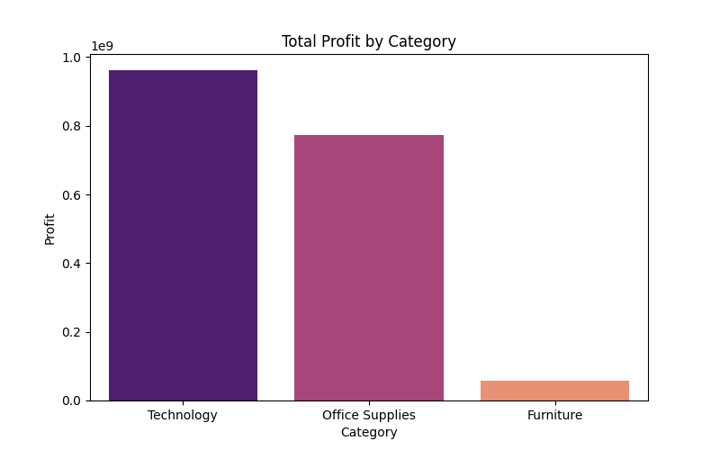
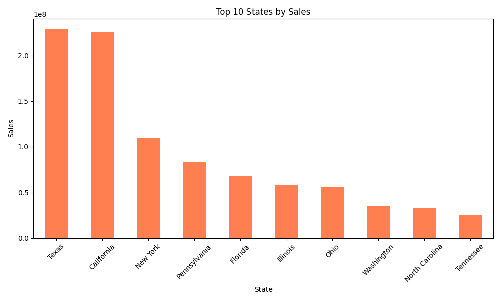
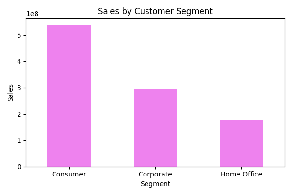

# superstore-sales-analysis
End-to-end Data Analysis project using Python, SQL, Excel and Power BI

# Data Loading

The dataset was loaded using Pandas.
During the import process, it was necessary to specify the correct column separator.

Some CSV files use semicolon (;) instead of comma (,) as a delimiter.
Without specifying the separator, Pandas would interpret the entire row as a single column.

This ensures that the dataset is properly structured into columns.

# Data Cleaning

Checked for missing values in columns such as Sales, Quantity, Profit, and Discount.

Filled or handled missing values as needed.

Created a new column Delivery Days to calculate shipping duration.

Saved the cleaned dataset for further analysis:

# Data Exploration

Initial exploration performed:

Examined data types and non-null counts using df.info().

Generated statistical summaries (mean, min, max, std) using df.describe().

Previewed first rows with df.head().

Identified anomalies such as negative profits or extreme values.

## Visual Analysis

### Total Sales by Category

### Total Profit by Category

### Top 10 States by Sales

### Sales by Customer Segment

# Skills & Tools Used

Python & Pandas – Data loading, cleaning, and exploration

SQL – Data querying and preparation (planned)

Excel – Data validation and preliminary analysis

Power BI – Dashboarding and visualization (planned)

GitHub – Version control and project management
