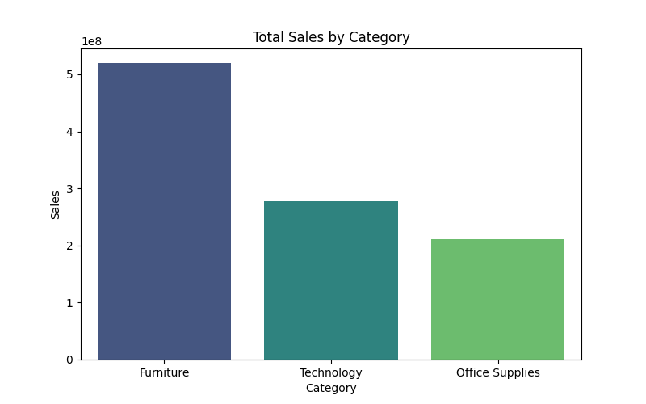
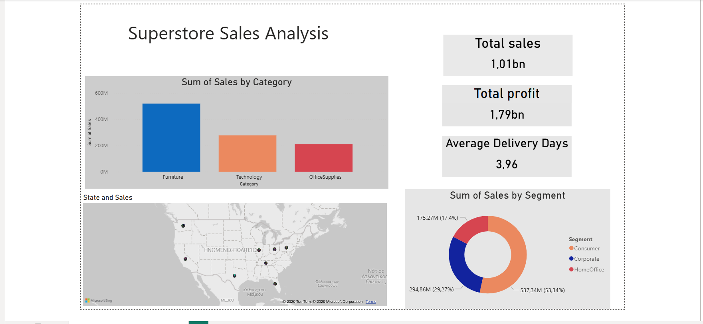

# Superstore-sales-analysis
End-to-end Data Analysis project using Python, SQL, Excel and Power BI

## Project Overview
This project performs an end-to-end analysis of a Superstore dataset to extract business insights,
KPIs, and visualize trends using Python, SQL, Excel, and Power BI.

## Data Loading

The dataset was loaded using Pandas.
During the import process, it was necessary to specify the correct column separator.

Some CSV files use semicolon (;) instead of comma (,) as a delimiter.
Without specifying the separator, Pandas would interpret the entire row as a single column.

This ensures that the dataset is properly structured into columns.

## Data Cleaning

Checked for missing values in columns such as Sales, Quantity, Profit, and Discount.

Filled or handled missing values as needed.

Created a new column Delivery Days to calculate shipping duration.

Saved the cleaned dataset for further analysis:

## Data Exploration

Initial exploration performed:

Examined data types and non-null counts using df.info().

Generated statistical summaries (mean, min, max, std) using df.describe().

Previewed first rows with df.head().

Identified anomalies such as negative profits or extreme values.

Observations:
- Technology category generates the highest profit, while Furniture has the highest sales but lower profitability.
- The top 3 states by sales are Texas, California, and New York.
- Consumer segment drives the majority of sales.

## Visual Analysis

### Total Sales by Category

#### Observation: Furniture dominates sales, followed by Technology and Office Supplies.

### Total Profit by Category

#### Observation: Technology is the most profitable category.

### Top 10 States by Sales

#### Observation: Technology is the most profitable category.

### Sales by Customer Segment

#### Observation: Consumer segment contributes the highest sales.

## SQL Analysis

Created SQL scripts to calculate key business metrics (KPIs) such as total sales, total profit, and sales by segment or category.

Examples of queries used are in file:  sql/analysis_queries.sql.

## Power BI Dashboard

Interactive dashboard created to visualize KPIs and sales trends.

Includes slicers for Category, State, and Segment.

Highlights total sales, total profit, top products, and delivery performance.

File: powerbi/superstore_sales_dashboard.pbix

## Skills & Tools Used

Python & Pandas – Data loading, cleaning, and exploration

SQL – Data querying and preparation (planned)

Excel – Data validation and preliminary analysis

Power BI – Dashboarding and visualization (planned)

GitHub – Version control and project management
